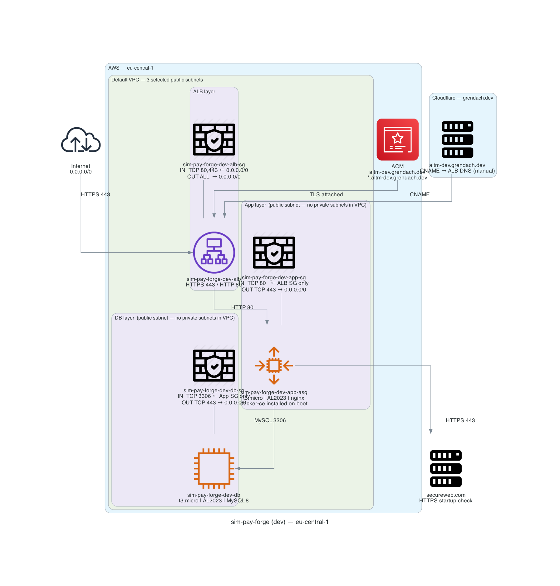

# sim-pay-forge

Payment provider POC on AWS — Terraform, HTTPS via ACM. Supports both **default VPC** (current) and **custom VPC with 3 private + 3 public subnets** (future).

## Architecture


- **POC requirement (current mode)** — 3 subnets from the AWS default VPC are used for the deployment.
- **VPC (future-ready mode)** — you can switch to a custom VPC with 3 public + 3 private subnets (`use_default_vpc = false`), which is the more proper production pattern.
- **ALB** — public, HTTPS 443, attached to 3 selected public subnets.
- **App** — single EC2 in ASG; private-preferred placement with public fallback when no private subnets exist.
- **DB** — single EC2 (MySQL); same subnet-selection behavior as app.
- **SGs** — ALB ingress from `allowed_client_cidrs`, app ingress from ALB only, DB ingress from app only.

> Current deployment: default VPC mode (no private subnets) → app and DB run in public subnets (`workload_network_mode = public-fallback`).

## Deploy

```bash
./aws-infra.sh apply
terraform output   # copy alb_dns_name → update Cloudflare CNAME
```

Restrict ingress in `environments/dev/terraform.tfvars` when needed:

```hcl
allowed_client_cidrs = [
  "185.72.187.163/32",
]
```

Terraform state locking: this project uses DynamoDB table `terraform-locks` (configured in `environments/dev/backend.hcl`) to prevent concurrent `plan/apply/destroy` runs against the same state.

## Troubleshooting
❌ "No ACm cert": Create free cert in AWS Console (public domain or wildcard)

❌ "Invalid AMI": aws ec2 describe-images --owners amazon --region eu-central-1

❌ State locked: aws dynamodb get-item --table-name terraform-locks --key '{"LockID":{"S":"your-lock"}}'

❌ Permissions: Attach AdministratorAccess policy temporarily

## Cleanup
```
./aws-infra.sh destroy
```
If using custom VPC (`use_default_vpc = false`), this will delete the VPC, subnets, IGW, and all workloads.  
If using default VPC (`use_default_vpc = true`), this will delete ALB, app ASG, DB EC2, and SGs only — the default VPC itself is left intact.


## Startup Dependency (POC)

Per POC requirement, instance startup uses a dependency gate in user-data: if a required package is not installed, the application does not start.

Current implementation uses Docker repository bootstrap and installs `docker-ce` (instead of the placeholder `example.com` package). If package installation fails, startup exits before nginx/application start.

## VPC Modes

### Default VPC (current, `use_default_vpc = true`)

Terraform discovers and uses the AWS default VPC in your account. Simplest for POC.

### Custom VPC (future, `use_default_vpc = false`)

Terraform creates a new VPC with:
- 3 public subnets (10.0.1.0/24, 10.0.2.0/24, 10.0.3.0/24)
- 3 private subnets (10.0.101.0/24, 10.0.102.0/24, 10.0.103.0/24)
- Internet Gateway for public subnets

To switch, edit `environments/dev/terraform.tfvars`:

```hcl
use_default_vpc = false
# optional:
custom_vpc_cidr = "10.0.0.0/16"
```

## DNS

The hosted zone `grendach.dev` is managed in **Cloudflare**. After each deploy, copy `alb_dns_name` from `terraform output` and update the CNAME record in Cloudflare manually:

```
altm-dev.grendach.dev  CNAME  <alb_dns_name>
```

The ACM certificate for `altm-dev.grendach.dev` uses DNS validation — add the validation CNAME from `certificate_validation_records` output to Cloudflare once, then it auto-renews.

## Diagrams

```bash
# macOS prereqs (one-time)
brew install graphviz && python3 -m pip install diagrams
# generate → docs/poc-architecture.png
python3 docs/generate_infra_diagram.py
```
