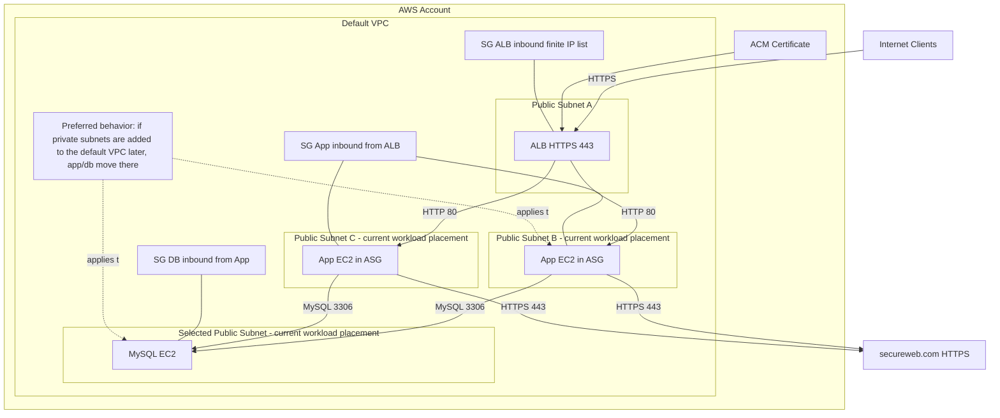

# POC Infrastructure Diagram

Current deployment note: this AWS account's default VPC has no private subnets, so the workload placement is currently `public-fallback`. ALB still uses 3 selected public subnets, and app/DB also run in selected public subnets until private subnets exist.

